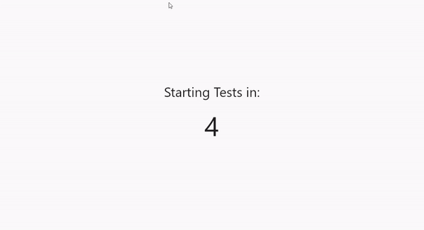

# Fast Flutter Driver
[](https://github.com/tomaszpolanski/fast_flutter_driver/actions?query=workflow%3A%22Build%22)
[](https://codecov.io/gh/tomaszpolanski/fast_flutter_driver)


| Plugin | Pub |
|--------|-----|
| [Command Line Tool][command_line_tool] | [][command_line_tool_package] |
| [UI Helper][ui_driver]| [][ui_driver_package] |




Toolkit for running rapidly flutter driver tests on desktop/mobile.

[This package][command_line_tool_package] simplifies the creation of Flutter Driver tests that can be run in bulk without restarting or rebuilding the application.
An example of how the toolkit works can be found in [this article][blazingly_fast_driver].

## The reasoning for Desktop tests
The desktop builds are almost identical to Android/iOS builds in regard to the UI.
Running tests on a simulator/emulator are painful. This can be even worse on your CI.

Your CI is usually a [dockerized Linux][example_docker] machine - running Linux `flutter driver` tests against Linux Flutter application is both fast and reliable.
This tool allows you to run your `flutter driver` tests much faster and more reliably than a build for a simulator/emulator.

The application flows that require Android/iOS plugins should still be run on a Simulator/Emulator or a real device.

## Running also on Android/iOS
While running tests against Desktop will find the majority of bugs, it is recommended to run sometimes against actual devices. There are bugs in Dart (like implementing your generics in an invalid way) that can cause a native crash on a mobile device and work properly on the desktop.It's prudent to run `fastdriver` tests before every release on a mobile device.

## Example
You can build and execute [the example][example] that works on any desktop system and [Docker][example_docker] as well.

## Usage

- Add `dev_dependency` to your `pubspec.yaml`
```yaml
dev_dependencies:
  fast_flutter_driver: ^1.1.0
```

- Create configuration class `test_driver/generic/test_configuration.dart`
```dart
import 'package:fast_flutter_driver/tool.dart';
import 'package:meta/meta.dart';

class TestConfiguration implements BaseConfiguration {
  const TestConfiguration({
    @required this.resolution,
    this.platform,
  }) : assert(resolution != null);

  factory TestConfiguration.fromJson(Map<String, dynamic> json) {
    return TestConfiguration(
      resolution: Resolution.fromJson(json['resolution']),
      platform: TestPlatformEx.fromString(json['platform']),
    );
  }
  @override
  final TestPlatform platform;
  @override
  final Resolution resolution;
  @override
  Map<String, dynamic> toJson() => <String, dynamic>{
        'resolution': resolution,
        if (platform != null) 'platform': platform.asString(),
      };
}

```
- Create dart file `test_driver/generic/generic.dart` with content and `MyApplication` as your main (root) application widget.
```dart
import 'dart:convert';

import 'package:fast_flutter_driver/driver.dart';
import 'package:flutter/foundation.dart';
import 'package:flutter/scheduler.dart';
import 'package:flutter/widgets.dart';
import 'package:flutter_driver/driver_extension.dart';

import 'test_configuration.dart';

void main() {
  debugDefaultTargetPlatformOverride = TargetPlatform.fuchsia;
  timeDilation = 0.1;
  enableFlutterDriverExtension(
    handler: (playload) => configureTest(
      TestConfiguration.fromJson(json.decode(playload)),
    ),
  );

  runApp(
    RestartWidget<TestConfiguration>(
      builder: (_, config) => MyApplication(),
    ),
  );
}

```
- Create a test, eg `test_driver/main_test.dart` 
```dart
import 'dart:convert';

import 'package:fast_flutter_driver/tool.dart';
import 'package:flutter_driver/flutter_driver.dart';
import 'package:test/test.dart';

import 'generic/test_configuration.dart';

void main(List<String> args) {
  FlutterDriver driver;
  final properties = TestProperties(args);

  setUpAll(() async {
    driver = await FlutterDriver.connect(dartVmServiceUrl: properties.vmUrl);
  });

  tearDownAll(() async {
    await driver?.close();
  });

  Future<void> restart() {
    return driver.requestData(
      json.encode(
        TestConfiguration(
          resolution: properties.resolution,
          platform: properties.platform,
        ),
      ),
    );
  }

  test('main application', () async {
    await restart();

    await driver.waitFor(find.byType('MyApplication'));
  });
}

```
- Install [fast_flutter_driver][command_line_tool] script:
```shell script
pub global activate fast_flutter_driver_tool
```
- Run:
```shell script
fastdriver
```

All done!

## What's next
This was the simplest setup of tests, next you would like to pass different application configuration so every time you run tests, they could be run with a different configuration (eg different page). To do that you need to add more properties to `TestConfiguration`.

A full example of how to do that can be found in [the example][example] folder.


[example]: https://github.com/tomaszpolanski/fast_flutter_driver/tree/master/example
[example_docker]: https://github.com/tomaszpolanski/fast_flutter_driver/tree/adding-docker-example/example#running-on-docker
[command_line_tool]: ./tool
[command_line_tool_package]: https://pub.dev/packages/fast_flutter_driver_tool
[ui_driver]: ./driver
[ui_driver_package]: https://pub.dev/packages/fast_flutter_driver
[blazingly_fast_driver]: https://medium.com/flutter-community/blazingly-fast-flutter-driver-tests-5e375c833aa
